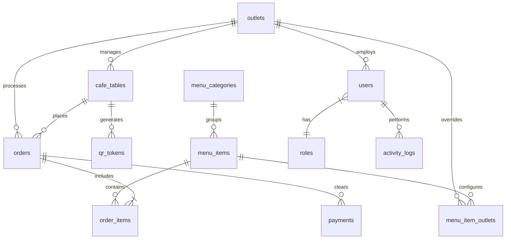
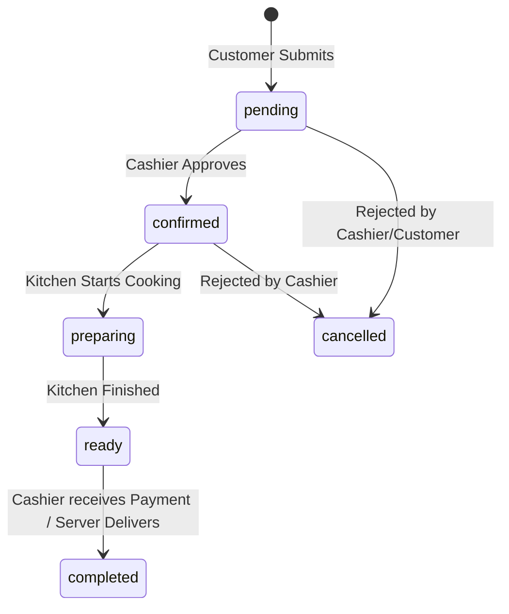

# PiyohPOS: Database Design (v1)

This document details the production-ready database design for PiyohPOS. This design isolates outlet-level operations, handles dynamic pricing and availability per outlet, supports QR ordering sessions, and optimizes read/write workloads for cashier, kitchen, and customer panels.

---

## 1. Entity Relationship Diagram (ERD) & Conceptual Relational Map

The system uses a tenant-like isolation strategy scoped by `outlet_id`. Below is the conceptual relational mapping:



---

## 2. Table Definitions & Schema Specification

### 1. `outlets`
Stores cafe branch information.
- **`id`** (BIGINT, PK, Auto Increment)
- **`name`** (VARCHAR(100)) - e.g., "Piyoh Galaxy", "Piyoh Bekasi"
- **`slug`** (VARCHAR(100), Unique) - URL-friendly slug
- **`address`** (TEXT)
- **`phone`** (VARCHAR(20))
- **`is_active`** (TINYINT(1), Default: 1)
- **`created_at`** / **`updated_at`** (Timestamp)
- *Indexes:* `slug` (Unique Index)

### 2. `cafe_tables`
Dining tables belonging to specific outlets.
- **`id`** (BIGINT, PK, Auto Increment)
- **`outlet_id`** (BIGINT, FK -> `outlets.id`, Indexed)
- **`number`** (VARCHAR(20)) - Table designation (e.g., "Galaxy-01")
- **`seating_capacity`** (INT, Default: 4)
- **`status`** (ENUM('vacant', 'occupied', 'reserved'), Default: 'vacant')
- **`created_at`** / **`updated_at`** (Timestamp)
- *Indexes:* Compound `(outlet_id, number)` to prevent duplicate table names within the same branch.

### 3. `qr_tokens`
Tokens associated with a table session. Refreshed on checkout to prevent cross-customer order hijacking.
- **`id`** (BIGINT, PK, Auto Increment)
- **`cafe_table_id`** (BIGINT, FK -> `cafe_tables.id`, Unique)
- **`token`** (VARCHAR(64), Unique) - Secure random token string
- **`expires_at`** (DateTime, Nullable) - Session expiration window
- **`is_active`** (TINYINT(1), Default: 1)
- **`created_at`** / **`updated_at`** (Timestamp)
- *Indexes:* `token` (Unique Index)

### 4. `menu_categories`
Categories to group menu items globally.
- **`id`** (BIGINT, PK, Auto Increment)
- **`name`** (VARCHAR(100)) - e.g., "Coffee", "Pastry"
- **`slug`** (VARCHAR(100), Unique)
- **`sort_order`** (INT, Default: 0)
- **`created_at`** / **`updated_at`** (Timestamp)
- *Indexes:* `slug` (Unique Index), `sort_order` (Index)

### 5. `menu_items`
Master menu list.
- **`id`** (BIGINT, PK, Auto Increment)
- **`menu_category_id`** (BIGINT, FK -> `menu_categories.id`, Indexed)
- **`name`** (VARCHAR(150))
- **`slug`** (VARCHAR(150), Unique)
- **`description`** (TEXT, Nullable)
- **`base_price`** (DECIMAL(12, 2)) - Default global price
- **`sku`** (VARCHAR(50), Unique, Nullable) - For Accurate integration mapping
- **`is_active`** (TINYINT(1), Default: 1)
- **`created_at`** / **`updated_at`** (Timestamp)
- *Indexes:* `slug` (Unique Index)

### 6. `menu_item_outlets`
Branch overrides for menu item price and availability.
- **`id`** (BIGINT, PK, Auto Increment)
- **`menu_item_id`** (BIGINT, FK -> `menu_items.id`)
- **`outlet_id`** (BIGINT, FK -> `outlets.id`)
- **`price`** (DECIMAL(12, 2)) - Branch-specific price override
- **`is_available`** (TINYINT(1), Default: 1) - Branch-specific inventory block
- **`created_at`** / **`updated_at`** (Timestamp)
- *Indexes:* Unique Compound `(menu_item_id, outlet_id)` (Unique Index), compound index on `(outlet_id, is_available)`.

### 7. `orders`
Order headers, scoped by outlet and table.
- **`id`** (BIGINT, PK, Auto Increment)
- **`outlet_id`** (BIGINT, FK -> `outlets.id`, Indexed)
- **`cafe_table_id`** (BIGINT, FK -> `cafe_tables.id`, Nullable) - Nullable for takeaway/delivery
- **`qr_token_id`** (BIGINT, FK -> `qr_tokens.id`, Nullable) - Validates table session security
- **`order_number`** (VARCHAR(50), Unique) - Readable code (e.g., "ORD-GXY-20260616-0001")
- **`customer_name`** (VARCHAR(100), Nullable)
- **`status`** (ENUM('pending', 'confirmed', 'preparing', 'ready', 'completed', 'cancelled'), Default: 'pending')
- **`tax_amount`** (DECIMAL(12, 2), Default: 0.00)
- **`service_charge`** (DECIMAL(12, 2), Default: 0.00)
- **`total_amount`** (DECIMAL(12, 2))
- **`accurate_sync_status`** (ENUM('unsynced', 'synced', 'failed'), Default: 'unsynced')
- **`created_at`** / **`updated_at`** (Timestamp)
- *Indexes:* `order_number` (Unique Index), compound `(outlet_id, status)`, `status`.

### 8. `order_items`
Individual items within an order.
- **`id`** (BIGINT, PK, Auto Increment)
- **`order_id`** (BIGINT, FK -> `orders.id`, Indexed)
- **`menu_item_id`** (BIGINT, FK -> `menu_items.id`, Indexed)
- **`quantity`** (INT)
- **`price`** (DECIMAL(12, 2)) - Snapshotted price at time of sale
- **`options`** (JSON, Nullable) - Variants / customizations (e.g. `{"sugar": "less", "shot": "extra"}`)
- **`notes`** (VARCHAR(255), Nullable) - Customer remarks
- **`created_at`** / **`updated_at`** (Timestamp)
- *Indexes:* `(order_id, menu_item_id)`

### 9. `payments`
Transactions linked to orders.
- **`id`** (BIGINT, PK, Auto Increment)
- **`order_id`** (BIGINT, FK -> `orders.id`, Unique)
- **`payment_method`** (ENUM('cash', 'qris', 'card', 'transfer'), Default: 'cash')
- **`status`** (ENUM('unpaid', 'paid', 'refunded', 'void'), Default: 'unpaid')
- **`amount_paid`** (DECIMAL(12, 2))
- **`transaction_reference`** (VARCHAR(100), Nullable, Indexed)
- **`paid_at`** (DateTime, Nullable)
- **`created_at`** / **`updated_at`** (Timestamp)

### 10. `users`
System staff.
- **`id`** (BIGINT, PK, Auto Increment)
- **`name`** (VARCHAR(255))
- **`email`** (VARCHAR(255), Unique)
- **`password`** (VARCHAR(255))
- **`active_outlet_id`** (BIGINT, FK -> `outlets.id`, Nullable) - Determines which tenant the cashier/kitchen staff works in
- **`remember_token`** (VARCHAR(100), Nullable)
- **`created_at`** / **`updated_at`** (Timestamp)

### 11. `roles` & `model_has_roles` (Spatie Permission)
Handled directly by Spatie Permision package.
- **`roles`**: `id`, `name`, `guard_name`, timestamps.
- **`model_has_roles`**: `role_id`, `model_type`, `model_id`.

### 12. `activity_logs` (Spatie Activitylog)
Tracks changes, creations, and security logs.
- Handled by `spatie/laravel-activitylog`. Includes columns: `id`, `log_name`, `description`, `subject_type`, `subject_id`, `causer_type`, `causer_id`, `properties`, timestamps.

---

## 3. Workflows & State Transitions

### A. Customer QR Lifecycle
```
Customer Scans QR 
  └─► QR code token validated in URL query (qr_tokens.token).
  └─► Cookie/Session set matching table_id and token.
Customer Browses Menu
  └─► Fetches menu_items, filtering availability & price overrides from menu_item_outlets based on outlet_id.
Customer Checkout
  └─► Inserts record in `orders` (status: 'pending') and `order_items`.
  └─► Emits Event to CashierPOS.
```

### B. Kitchen Order Preparation (State Transition)
Kitchen operations can only transition orders along this sequential graph:



---

## 4. Multi-Outlet (Tenancy) Scoping
To satisfy the business requirement that **"Satu outlet tidak boleh melihat order outlet lain"**:
1. Every operations table (`cafe_tables`, `orders`, `menu_item_outlets`) contains an `outlet_id` column.
2. In Eloquent, a Global Scope (e.g. `OutletScope`) is registered for cashiers/kitchen staff. When queries are run, a `WHERE outlet_id = ?` clause is automatically appended based on the logged-in user's `active_outlet_id`.
3. Super admins bypass this scope to view consolidated reports.

---

## 5. Master vs Branch Pricing Model
To solve the menu requirement (Master menu but dynamic price/availability per branch):
- Global metadata (Name, description, categories, image paths) is kept in the master `menu_items` table.
- Branch-specific operational states (prices, out-of-stock toggle) are kept in the child `menu_item_outlets` table.
- **Read Query:**
  ```sql
  SELECT m.name, COALESCE(o.price, m.base_price) AS price, COALESCE(o.is_available, m.is_active) AS is_available
  FROM menu_items m
  LEFT JOIN menu_item_outlets o ON m.id = o.menu_item_id AND o.outlet_id = :outlet_id
  WHERE m.is_active = 1;
  ```

---

## 6. Reporting Queries (Operational Strategy)

### A. Daily / Monthly Sales Report
```sql
SELECT DATE(created_at) AS sale_date, COUNT(id) AS total_orders, SUM(total_amount) AS revenue
FROM orders
WHERE status = 'completed' AND outlet_id = :outlet_id
GROUP BY sale_date;
```

### B. Top Selling Menu Items
```sql
SELECT mi.name, SUM(oi.quantity) AS total_sold, SUM(oi.quantity * oi.price) AS total_revenue
FROM order_items oi
JOIN menu_items mi ON oi.menu_item_id = mi.id
JOIN orders o ON oi.order_id = o.id
WHERE o.status = 'completed' AND o.outlet_id = :outlet_id
GROUP BY mi.id, mi.name
ORDER BY total_sold DESC;
```

---

## 7. Recommended Indexes

| Table | Index Columns | Purpose |
| :--- | :--- | :--- |
| `cafe_tables` | `(outlet_id, number)` | Quick table lookup within an outlet; enforces unique table labels per branch. |
| `qr_tokens` | `token` | Speed up session validations when QR is scanned. |
| `menu_item_outlets` | `(outlet_id, menu_item_id)` | Fast menu parsing on branch menu views. |
| `orders` | `(outlet_id, status)` | Fast loading of pending/cooking queues on Cashier and Kitchen dashboards. |
| `orders` | `order_number` | Quick single-order searches. |
| `order_items` | `order_id` | Fast join rendering for order details. |

---

## 8. Design Rationale, Risks, & Alternatives

### Design Rationale:
- **Tokenized QR Sessions (`qr_tokens`)**: Securing table ordering via dynamic tokens prevents malicious script injections from ordering to other tables by simply changing the table number in the URL.
- **De-coupled Pricing (`menu_item_outlets`)**: Keeping branch overrides separate from the master table keeps the master menu clean and avoids duplicating core product metadata.

### Risks:
- **QR Token Expiry Hijacks**: If tokens expire while a customer has items in their cart, the cart submission will fail.
  - *Mitigation:* Graceful Client UX to warn the user and refresh the token session with cashier/waiter approval if needed.
- **Reporting Load**: Large historical aggregation scans (Sales reports) might slow down the database if ran directly on transaction tables during peak operational hours.
  - *Mitigation:* Create a cached aggregated table or read-replica for high-overhead report generation.

### Alternatives:
- **Separate Databases per Outlet**:
  - *Pros:* Complete database isolation.
  - *Cons:* Makes centralized reporting and global master menu updates extremely complex. Scrapped in favor of the current single database with `outlet_id` scoping.
