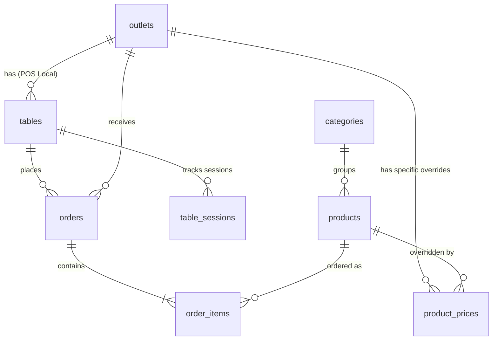

# Master Data Architecture Design & Audit Report - PiyohPOS

This document outlines the architectural refactoring audit and integration proposal for separating master data management (PiyohWeb) from transactional operations (PiyohPOS).

---

## 1. Codebase Audit

### Resource Retention & Separation Matrix

| Resource / Component | Proposed Action | Destination | Rationale |
| :--- | :--- | :--- | :--- |
| **`OutletResource`** | **Delete from Filament** | PiyohWeb | Outlets are master entities and should be managed centrally. |
| **`CategoryResource`** | **Delete from Filament** | PiyohWeb | Product categories are global master data. |
| **`ProductResource`** | **Delete from Filament** | PiyohWeb | Product catalog is managed centrally. |
| **`TableResource`** | **Retain** | PiyohPOS | Tables represent physical layout configuration specific to the local POS system. |
| **`Outlet` Model & Table** | **Retain (Read-Only Cache)** | PiyohPOS | Retained locally for relationship integrity with tables/orders, but updated only via sync. |
| **`Category` Model & Table** | **Retain (Read-Only Cache)** | PiyohPOS | Retained locally to render menus instantly without fetching APIs per scan. |
| **`Product` Model & Table** | **Retain (Read-Only Cache)** | PiyohPOS | Needed for cart, prices, and order items relationships. |
| **`ProductPrice` Model & Table** | **Retain (Read-Only Cache)**| PiyohPOS | Needed to calculate order totals on-site. |
| **`TableSession`, `Order`, `OrderItem`**| **Retain (Transactional)** | PiyohPOS | Scoped purely to POS checkout and operations. |

---

## 2. Integration Strategy: Option A (API-Driven Local Sync)

To prevent PiyohPOS from becoming the source of truth for Master Data while keeping it offline-resilient and extremely fast for local QR ordering, we will implement **Option A** with local read-only caching:

```
+------------------+                    +------------------+
|     PiyohWeb     |                    |     PiyohPOS     |
|   (Master Data)  |                    |  (Transactional) |
|                  |                    |                  |
|  [Outlets]       |                    |  [Outlets Cache] |
|  [Categories]    |--[Sync API Push]-->|  [Categories C.] |
|  [Products]      |  (Webhooks/Sync)   |  [Products Cache]|
|  [Prices]        |                    |  [Prices Cache]  |
|                  |                    |                  |
|                  |                    |  [Table Sessions]|
|                  |                    |  [Orders/Items]  |
+------------------+                    +------------------+
```

### Data Flow
1. **Creation / Edit:** Admin updates products, prices, categories, or outlets on **PiyohWeb**.
2. **Propagation:** **PiyohWeb** fires a webhook or API request to **PiyohPOS** with the updated payload.
3. **Storage:** **PiyohPOS** updates its local read-only replica tables (`outlets`, `categories`, `products`, `product_prices`).
4. **Ordering:** Customer scans QR code -> POS reads local cache tables -> processes order -> stores locally in `orders` & `order_items`.

---

## 3. API Contract Draft

### Sync Endpoint (Exposed by PiyohPOS, Called by PiyohWeb)

#### `POST /api/v1/sync/master-data`
Synchronizes master data updates from PiyohWeb to the local POS database cache.

* **Headers:**
  ```http
  Authorization: Bearer <Secret_API_Token>
  Content-Type: application/json
  Accept: application/json
  ```

* **Request Payload Format:**
  ```json
  {
    "type": "product_update",
    "timestamp": 1781682700,
    "data": {
      "id": 101,
      "name": "Es Kopi Susu Piyoh",
      "slug": "es-kopi-susu-piyoh",
      "description": "Kopi susu signature gula aren",
      "category_id": 5,
      "base_price": 20000.00,
      "sku": "KPS-001",
      "is_active": true,
      "prices": [
        {
          "outlet_id": 1,
          "price": 22000.00,
          "is_available": true
        },
        {
          "outlet_id": 2,
          "price": 20000.00,
          "is_available": false
        }
      ]
    }
  }
  ```

* **Success Response:**
  ```json
  {
    "status": "success",
    "message": "Master data cache synced successfully."
  }
  ```

---

## 4. Role & Permissions Matrix

| Role | System | Capabilities |
| :--- | :--- | :--- |
| **Super Admin** | PiyohWeb & PiyohPOS | Full access to master data and all POS configuration. |
| **Admin (PiyohWeb)** | PiyohWeb | Manages global menu items, base prices, and outlet setups. |
| **Cashier (POS)** | PiyohPOS | Access to local tables, processing local payments, closing local table sessions. |
| **Kitchen (POS)** | PiyohPOS | Viewing and updating preparation status for orders at their active outlet. |

---

## 5. Final Entity Relationship Diagram (ERD)


