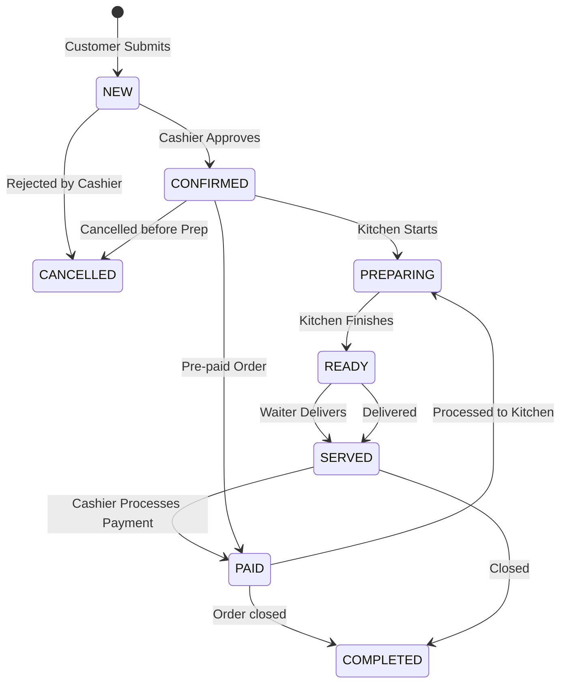

# Order Status Lifecycle & Transitions

This document details the state machine governing order processing, preparation, and payments on PiyohPOS.

---

## 1. Lifecycle States

1. **`NEW`**
   * Description: Order placed by customer via table QR ordering but not yet reviewed.
2. **`CONFIRMED`**
   * Description: Cashier approves the order, confirming kitchen availability.
3. **`PREPARING`**
   * Description: Kitchen crew starts preparing the food/beverage items.
4. **`READY`**
   * Description: Cooking is finished; items are ready to be dispatched from the kitchen.
5. **`SERVED`**
   * Description: Waiter/server has delivered the items to the dining table.
6. **`PAID`**
   * Description: Cashier has successfully processed customer payment.
7. **`COMPLETED`**
   * Description: Final state. Order is served and paid.
8. **`CANCELLED`**
   * Description: Rejected by cashier or cancelled before preparation starts.

---

## 2. Permitted Transitions

Below is the transition flow:

