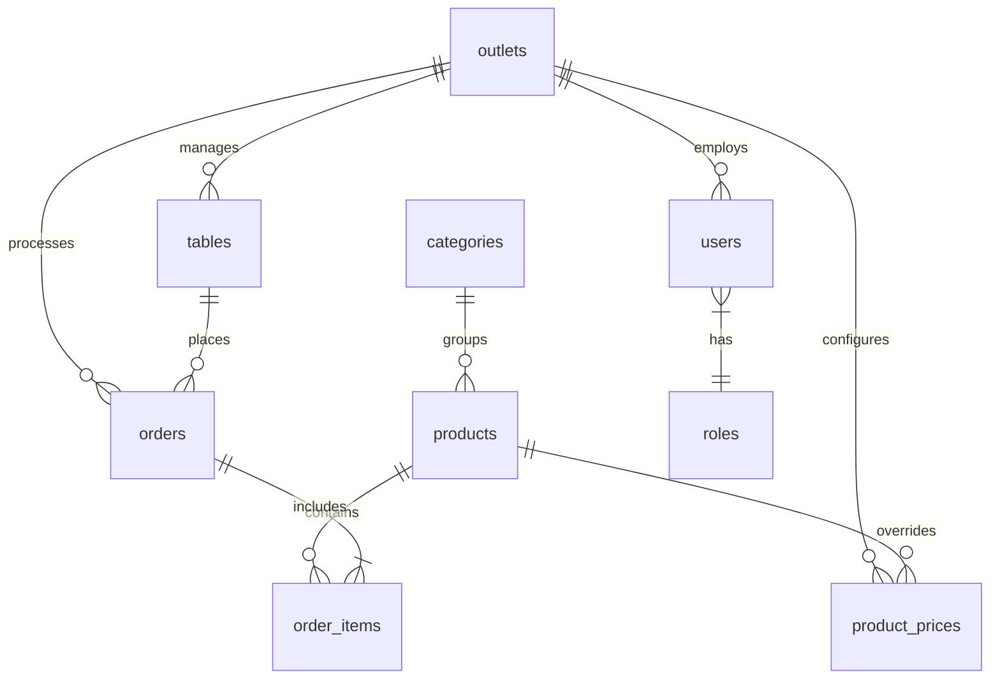

# Sprint 1 Foundation Report - PiyohPOS

This document details the foundation layer implemented for PiyohPOS (QR ordering and multi-outlet system) during Sprint 1.

---

## 1. Entity Relationship Diagram (ERD)

Below is the database ERD showing our custom tables:



---

## 2. Relasi Model (Model Relationships)

- **`Outlet`**
  - `hasMany(Table::class)`
  - `hasMany(ProductPrice::class)`
  - `hasMany(Order::class)`
  - `hasMany(User::class, 'active_outlet_id')`
- **`Table`**
  - `belongsTo(Outlet::class)`
  - `hasMany(Order::class)`
- **`Category`**
  - `hasMany(Product::class)`
- **`Product`**
  - `belongsTo(Category::class)`
  - `hasMany(ProductPrice::class)`
  - `hasMany(OrderItem::class)`
- **`ProductPrice`**
  - `belongsTo(Product::class)`
  - `belongsTo(Outlet::class)`
- **`Order`**
  - `belongsTo(Outlet::class)`
  - `belongsTo(Table::class)`
  - `hasMany(OrderItem::class)`
- **`OrderItem`**
  - `belongsTo(Order::class)`
  - `belongsTo(Product::class)`
- **`User`**
  - `belongsTo(Outlet::class, 'active_outlet_id')`
  - Spatie role & permission traits (`HasRoles`)

---

## 3. Daftar Resource Filament (Filament Resources)

All resources are created in Filament v4 structure:
1. **`OutletResource`**: Manages cafe outlets.
2. **`TableResource`**: Manages dining tables under each outlet.
3. **`CategoryResource`**: Manages global menu/product categories.
4. **`ProductResource`**: Manages products, with a nested `ProductPricesRelationManager` to set custom prices and availability overrides per outlet.

---

## 4. Daftar Role

Roles are registered via Spatie Permission:
- `super_admin`: Full system control across all outlets.
- `admin`: Outlet-level administrative control.
- `cashier`: Register operations, order management.
- `kitchen`: Order fulfillment, prep status updates.

---

## 5. Hasil Migrate

Successful output of `php artisan migrate:fresh --seed`:

```text
 Dropping all tables .. 95.62ms DONE

 INFO Preparing database. 

 Creating migration table .. 12.88ms DONE

 INFO Running migrations. 

 0001_01_01_000000_create_users_table .. 42.21ms DONE
 0001_01_01_000001_create_cache_table .. 24.13ms DONE
 0001_01_01_000002_create_jobs_table .. 41.61ms DONE
 2026_06_16_072701_create_permission_tables .. 130.55ms DONE
 2026_06_16_074825_create_outlets_table .. 11.69ms DONE
 2026_06_16_074829_create_categories_table .. 12.33ms DONE
 2026_06_16_074829_create_tables_table .. 27.10ms DONE
 2026_06_16_074830_create_products_table .. 35.54ms DONE
 2026_06_16_074831_create_product_prices_table .. 58.85ms DONE
 2026_06_16_074832_create_orders_table .. 60.90ms DONE
 2026_06_16_074833_create_order_items_table .. 54.94ms DONE
 2026_06_16_074834_add_active_outlet_id_to_users_table .. 34.76ms DONE

 INFO Seeding database. 
```

- **Seeded Outlets**: Piyoh Galaxy, Piyoh Bekasi
- **Seeded Tables**: 20 tables per outlet (total 40 tables)
- **Seeded Users**: Super Admin (`superadmin@piyohkopi.com`)
