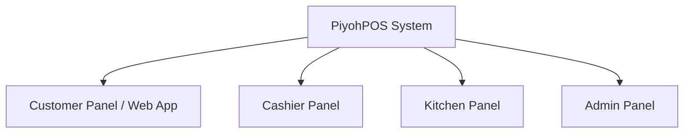
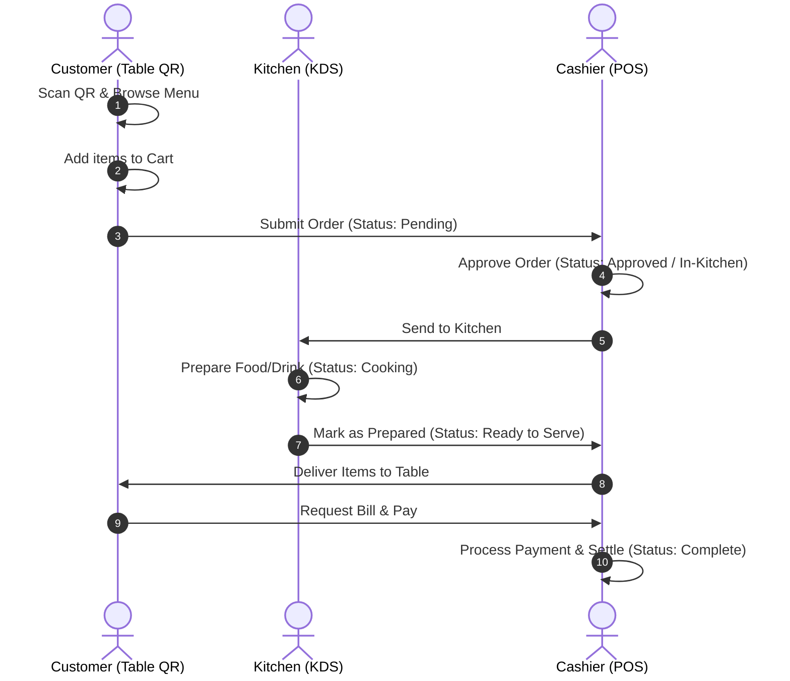

# PiyohPOS: System Architecture

This document describes the application architecture and operational flow for the PiyohPOS system.

---

## 1. Panel Architecture

PiyohPOS is built as a multi-panel application using **Laravel 12** and **Filament v4**. This structure keeps the user interfaces and authorization scopes strictly separated and optimized for their respective users:



### A. Customer Panel
- **Interface**: Mobile-first web interface accessed via QR code scan at the dining tables.
- **Roles**: Anonymous customer sessions (tied to table token/session).
- **Features**: View digital menu, select items, configure variants/notes, build cart, place self-service orders.

### B. Cashier Panel
- **Interface**: Optimized POS grid layout (tablet/desktop screens).
- **Roles**: `cashier`, `admin`, `super_admin`.
- **Features**: View active orders, accept/modify orders, process payments, print receipts, manage shifts, and handle walk-in customers.

### C. Kitchen Panel
- **Interface**: Kanban or list view for real-time kitchen orders (optimized for kitchen displays/KDS).
- **Roles**: `kitchen`, `admin`, `super_admin`.
- **Features**: Live-update incoming orders, track item prep status (Queue, Cooking, Done), notify waitstaff for pickup.

### D. Admin Panel
- **Interface**: Core administrative dashboard.
- **Roles**: `admin`, `super_admin`.
- **Features**: Manage menus (categories, products, pricing, stock), manage outlets, view transactions, manage users & roles, track audit logs via Spatie Activitylog, and run backups.

---

## 2. Order Lifecycle & Flow

The lifecycle of an order spans across all panels, ensuring real-time visibility from table placement to payment settlement.



---

## 3. Multi-Outlet Architecture & Data Flow

PiyohPOS is architected to support multiple outlets (e.g., **Piyoh Galaxy** and **Piyoh Bekasi**).

### Isolation Rules
- **Outlets** are isolated at the data layer using tenant/outlet scope (`outlet_id` on key tables).
- **Tables** belong to a specific outlet.
- **Cashiers** and **Kitchen Staff** are assigned to a specific outlet.
- **Super Admins** can view global data and switch between outlets.

### Outlet Context Schema Flow
```
[Outlet: Piyoh Galaxy]
  ├── Tables (101 - 110)
  ├── Cashier Staff (Cashier A) ──> POS Panel (Galaxy Scope)
  └── Kitchen Staff (Kitchen A) ──> KDS Panel (Galaxy Scope)

[Outlet: Piyoh Bekasi]
  ├── Tables (201 - 220)
  ├── Cashier Staff (Cashier B) ──> POS Panel (Bekasi Scope)
  └── Kitchen Staff (Kitchen B) ──> KDS Panel (Bekasi Scope)
```

1. **Staff Login**: When cashier or kitchen staff log in, their session is bound to their assigned `outlet_id`.
2. **Order Routing**: Orders placed via table QR code are automatically tagged with the table's `outlet_id` and routed exclusively to that outlet's cashier and kitchen dashboards.
3. **Menu Scoping**: Menus, prices, and item availability can be customized per outlet.
